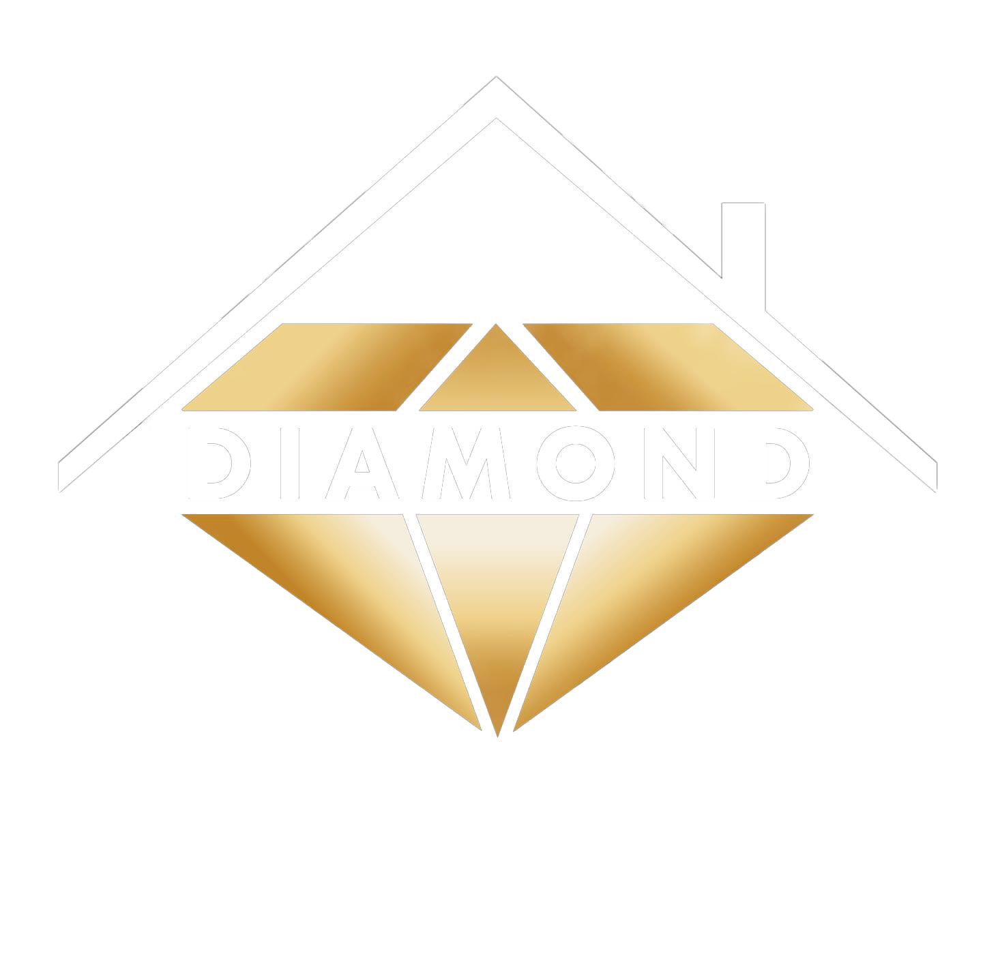

# Diamond Construction & Renovations



## 🏗️ About Diamond

Diamond specializes in high-quality construction and renovation services across Northern Israel, with a focus on the Carmiel region. We transform the renovation experience from a stressful period into a positive journey by maintaining the highest professional standards, using premium materials, and ensuring clear communication throughout the entire process.

Our philosophy is built on the understanding that a home is much more than four walls - it represents warmth, security, and love. We make every effort to deliver this experience to our clients through meticulous planning and quality workmanship.

## 🌟 Our Vision

To change the negative atmosphere that often surrounds renovation processes both in Israel and worldwide, transforming it from a stressful experience into one filled with satisfaction and enjoyment.

## 🛠️ Our Services

- **Complete Home Renovations** - Full-service solutions from concept to completion
- **Bathroom Renovations** - Professional renovations with quality materials and advanced techniques
- **Kitchen Renovations** - Modern kitchen designs that combine functionality and aesthetics
- **Custom Construction** - Building additions and new structures to your specifications
- **General Maintenance** - Ongoing maintenance services for homes, businesses, and multi-unit properties

## 💼 Why Choose Diamond?

- **Professionalism** - A skilled team with extensive training and experience
- **Quality** - Using only the finest materials and attention to every detail
- **Reliability** - Meeting deadlines and maintaining transparency with clients
- **Personal Approach** - Client-centered service that prioritizes your needs
- **Client Advocacy** - We never ignore issues or cut corners - your satisfaction comes first
- **Full-Service Support** - Option for comprehensive management including design planning, material selection, and complete oversight

## 🏆 Our Process

1. **Initial Contact** - We meet to discuss your needs (designers are welcome)
2. **Consultation** - Receive professional tips and recommendations
3. **Project Scoping** - We review the work scope and develop detailed plans
4. **Proposal** - A comprehensive specification including materials and project phases
5. **Revisions** - Further meetings for adjustments and updates
6. **Contract Signing** - Clear agreement on all aspects of the work
7. **Project Execution** - Client involvement at every stage with a dedicated communication group for continuous updates
8. **Completion** - Final delivery and thorough cleaning of the site

## 🤝 Our Clients

We're proud to have served many satisfied clients including:
- Nefesh Yehudi
- Carmiel Municipality
- Ichud Hatzalah
- Terem Medical Centers
- Katif
- Shtilim Education Network
- Many happy homeowners throughout Northern Israel

## 💻 Website Technical Information

### Technology Stack

- **Frontend**: React with TypeScript
- **Styling**: Tailwind CSS, Radix UI
- **Animation**: Framer Motion
- **Building**: Vite
- **Accessibility**: Full accessibility features including high contrast, color inversion, and more

### Features

- **Responsive Design** - Optimized for all device types
- **Multi-Language Support** - Hebrew and English
- **Accessibility Features** - Making our site usable by everyone
- **Dark/Light Mode** - Comfortable viewing in any environment
- **Contact Forms** - Easy ways to get in touch with our team

### Development

To run this project locally:

```bash
# Install dependencies
npm install

# Start development server
npm run dev

# Build for production
npm run build
```

## 📞 Contact Us

For a quote or consultation without obligation, contact us:
- Phone: 052-703-6959
- WhatsApp: [Send a message now](https://wa.me/972527036959)
- Email: diamondbuilding.il@gmail.com

---

© 2025 Diamond Building & Renovations. All rights reserved.